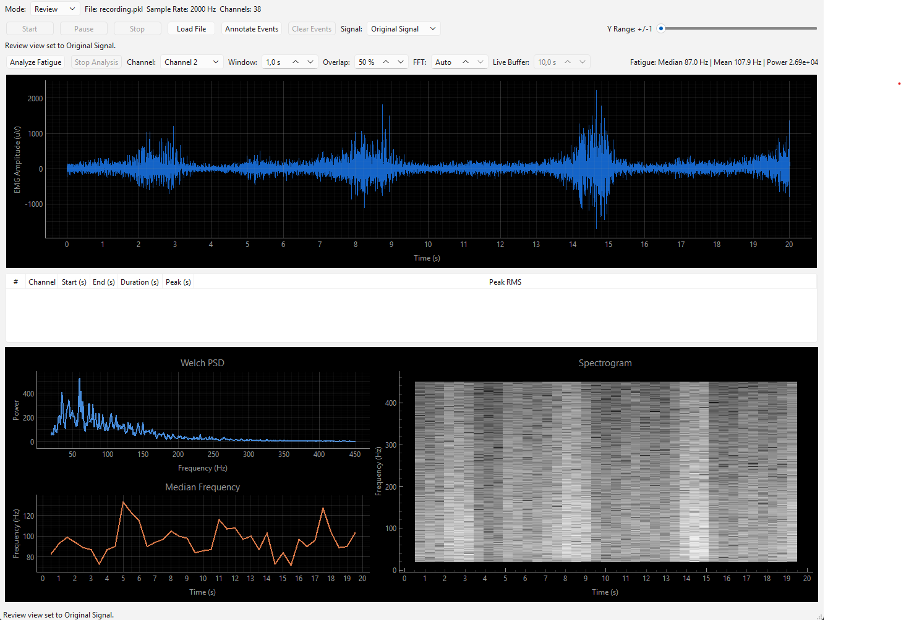
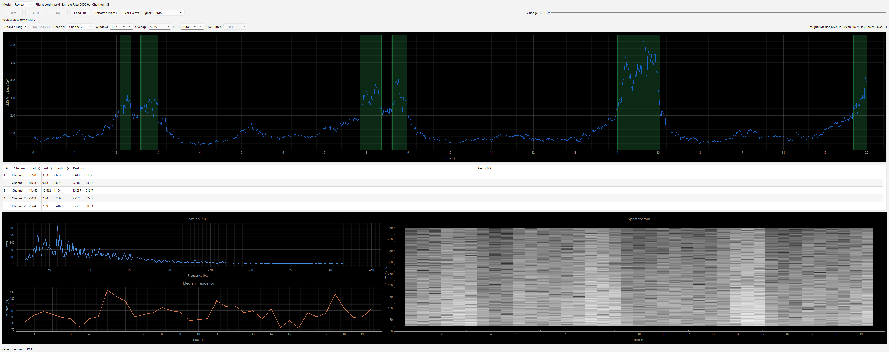

# Realtime EMG DSP

A desktop application for loading, visualizing, and analyzing multi-channel EMG recordings. The app currently focuses on review-mode workflows for `.pkl` recordings, with a live-streaming architecture in place for future hardware integration.

## Screenshots

### Review Mode



### Automated Event Annotation



## Current Features

- Load EMG recordings from `.pkl` files.
- Display multi-channel EMG data as `channels x samples`.
- Select one active channel for graph inspection.
- Switch review signal views:
  - Original signal
  - Bandpass-filtered signal
  - RMS envelope
- Adjust graph amplitude range with the Y-range slider.
- Run fatigue analysis in review mode or live mode scaffolding:
  - Welch PSD
  - Spectrogram
  - Median frequency
  - Mean frequency
  - Band power
- Automatically detect muscle contraction events from the RMS envelope.
- Highlight detected event regions with translucent green overlays.
- View detected events in a table with channel, start/end time, duration, peak time, and peak RMS.
- Use a background worker thread for fatigue analysis so the UI remains responsive.

## Tech Stack

- Python
- PySide6 for the desktop UI
- PyQtGraph for signal plotting and graph overlays
- NumPy for array operations
- SciPy for DSP, spectral analysis, and peak detection
- pytest for automated tests
- Ruff for linting

## Project Structure

```text
src/
  main.py                    Application entry point
  core/
    data_source.py           File and live data-source abstractions
    data_worker.py           Background streaming worker
    dsp_live.py              Live chunk filtering and RMS processing
    dsp_review.py            Review-mode filtering and RMS processing
    event_annotation.py      Automated contraction event detection
    fatigue_analysis.py      Fatigue metrics and spectral analysis
  ui/
    main_window.py           Main PySide6 interface
    fatigue_worker.py        Background fatigue-analysis workers
tests/
  test_dsp_live.py
  test_dsp_review.py
  test_event_annotation.py
  test_fatigue_analysis.py
  test_headless_boundary.py
docs/
  images/                    README screenshots
```

## Setup

Create and activate a virtual environment:

```powershell
python -m venv venv
.\venv\Scripts\Activate.ps1
```

Install dependencies:

```powershell
pip install -r requirements.txt
```

## Running The App

```powershell
python src\main.py
```

By default, the app looks for:

```text
data/recording.pkl
```

You can also choose a different recording with the `Load File` button.

## Expected Data Format

The review-mode loader expects a pickle file containing at least:

```python
{
    "biosignal": ...,
    "device_information": {
        "sampling_frequency": 2000
    }
}
```

Raw data files are intentionally ignored by Git:

```text
data/*.pkl
data/*.csv
data/*.npy
```

Keep local recordings in `data/`, but do not commit them.

## Analysis Workflow

1. Load a `.pkl` EMG recording.
2. Select a channel from the unified channel selector.
3. Inspect the original, filtered, or RMS signal view.
4. Use `Analyze Fatigue` to compute frequency-domain fatigue metrics.
5. Use `Annotate Events` to detect contraction regions.
6. Review green highlighted events on the graph.
7. Inspect detected events in the event table.

## Automated Event Annotation

Event annotation uses the RMS envelope as the activity signal. The detector:

1. Converts input data to a channel matrix.
2. Cleans invalid numeric values.
3. Computes an adaptive threshold per channel using the median and MAD.
4. Finds contiguous regions above the threshold.
5. Merges regions separated by short gaps.
6. Rejects regions shorter than the minimum duration.
7. Uses `scipy.signal.find_peaks` to identify the strongest peak in each event.

The UI renders the resulting time ranges with `pyqtgraph.LinearRegionItem`.

## Testing

Run the test suite:

```powershell
.\venv\Scripts\pytest.exe -q
```

Run lint checks:

```powershell
.\venv\Scripts\ruff.exe check .
```

The tests intentionally keep core DSP validation separate from UI imports, so signal-processing logic remains testable in headless environments.

## Current Limitations

- Live hardware acquisition is scaffolded but not fully implemented.
- Event annotation sensitivity is currently controlled by constants, not UI controls.
- Event annotations are not exported or saved yet.
- Manual event editing is not implemented yet.
- Fatigue plots are available, but event-specific fatigue summaries are not yet calculated.

## Roadmap

- Export event annotations to CSV or JSON.
- Add sensitivity controls for event detection.
- Support manual event creation, deletion, and boundary editing.
- Save and reload annotation files next to recordings.
- Compute per-event features such as integrated EMG, mean RMS, max RMS, and event-specific fatigue metrics.
- Extend event detection to live mode.
- Generate analysis reports with screenshots, event tables, and fatigue summaries.
